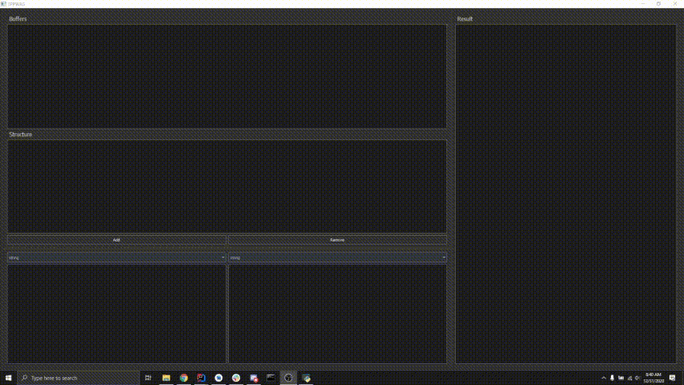

# SPPWAG
## simple proto parser with a gui

This is SPPWAG, a very simple tool I built to make my/your life easy when dealing with custom-built/unknown protocols/buffers.

```
pip3 install -r requirements.txt
python3 sppwag.py
```



